# Eontera: Natural Events

A Flutter-based natural event awareness and scientific data visualization application combining global event data, interactive mapping, scientific imagery, and ISS/sky context.

> **Google Play Status:** Closed Testing  
> **Platform:** Android  
> **Source Code:** Private repository  
> **Developer:** Berkay Ay

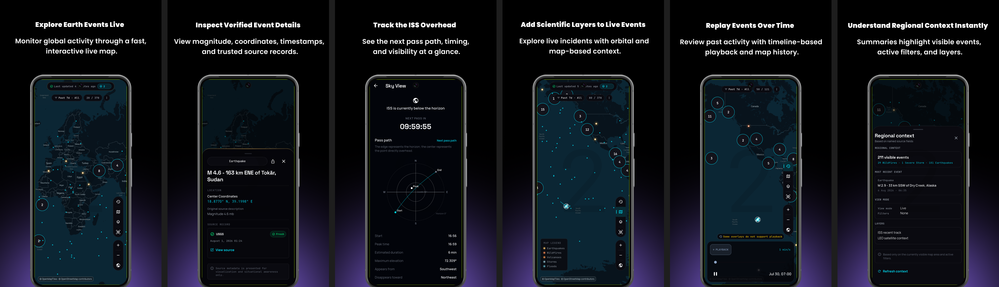

## About Eontera

Eontera is an independently developed Flutter application for exploring source-backed natural events and environmental data through a unified interactive map.

The application combines public scientific data sources, geospatial visualization, event detail surfaces, map layers, watch-zone flows, historical playback, and ISS/sky context.

Eontera is an informational and data-visualization product. It is not an official warning, emergency-response, or hazard-prediction service.

## Key Features

- Live global natural event map
- Earthquake, wildfire, flood, storm, volcano and other event data
- Source-backed event details and coordinates
- NASA scientific imagery layers
- ISS and orbital context
- Historical event playback
- Regional context summaries
- On-device watch zones and preferences
- Turkish and English localization

## Screenshots

  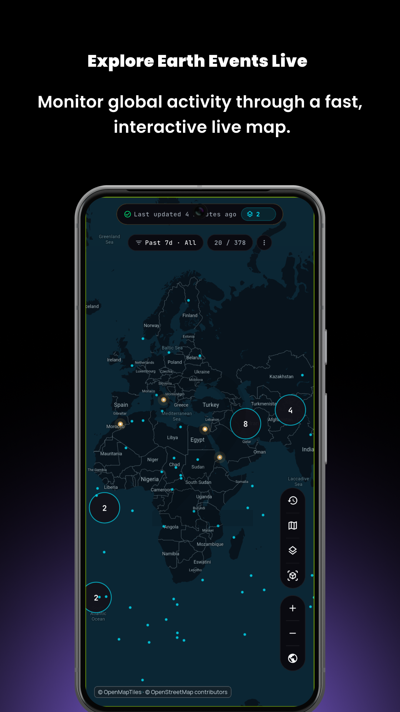
  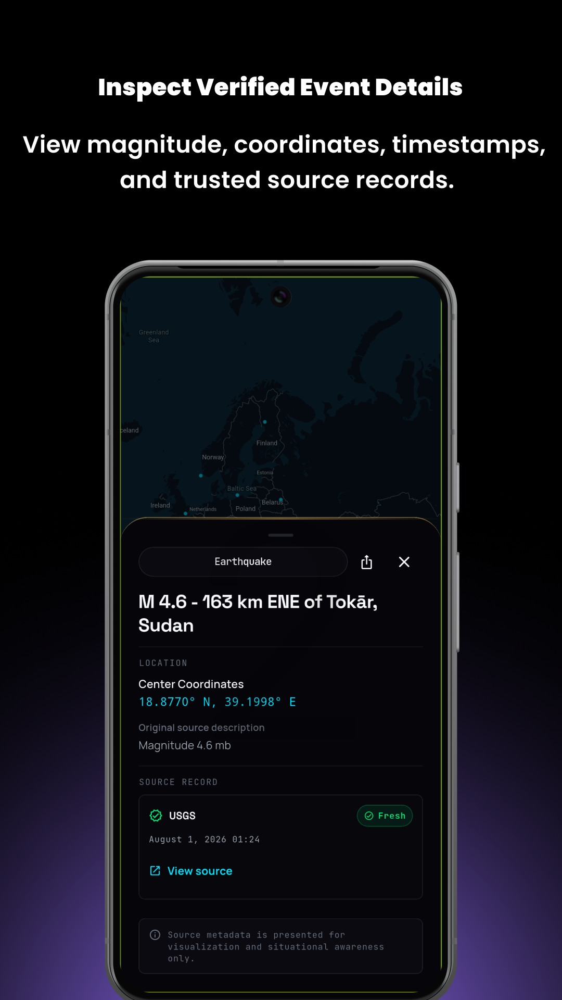
  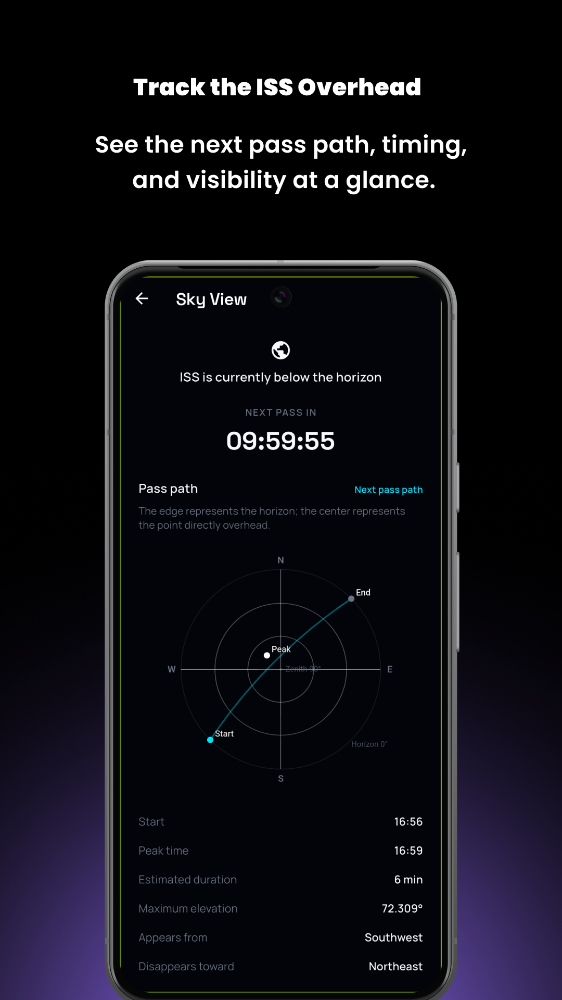

  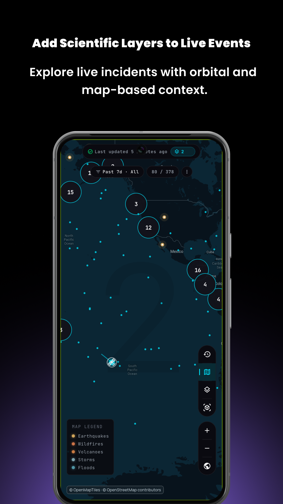
  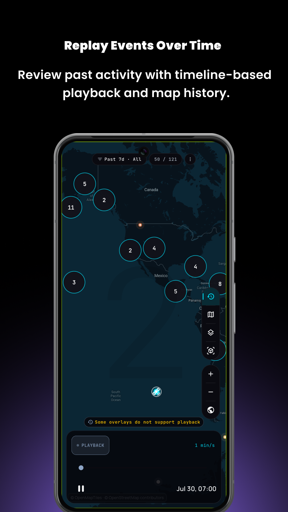
  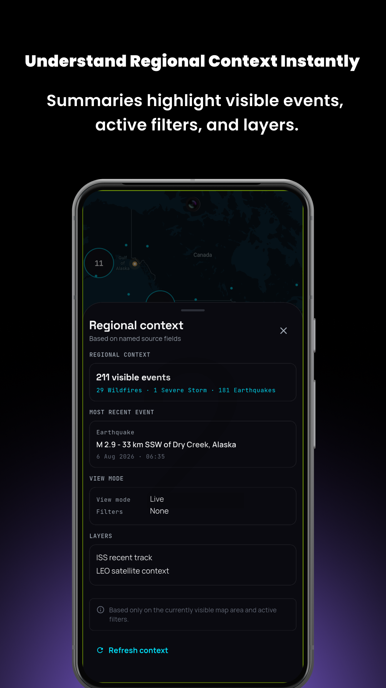

## Data Sources

Eontera integrates publicly accessible scientific and environmental data sources, including:

- NASA EONET
- U.S. Geological Survey (USGS)
- NASA GIBS / EOSDIS Earthdata
- CelesTrak
- Public ISS position data
- OpenFreeMap with OpenStreetMap-derived map data

## Technical Overview

- Flutter / Dart
- REST APIs
- Geospatial data visualization
- Interactive map interfaces
- Local device storage
- Turkish / English localization
- Android release and Google Play testing workflows
- Git / GitHub

## Privacy & Product Principles

- No account required
- No advertising
- No analytics or behavioral profiling
- Watch zones and user preferences are stored on-device
- Source attribution and data transparency are treated as core product features

## Source Code

The production source code is maintained in a private repository.

This public repository exists solely as a portfolio and product showcase. It does not contain application source code, signing material, API secrets, private configuration, or internal release credentials.

## Turkish Screenshots

Türkçe ekran görüntülerini göster

 

  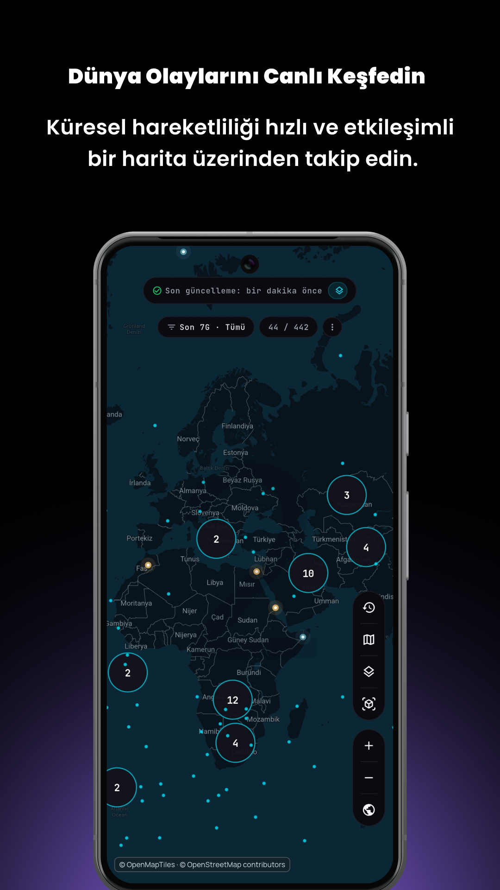
  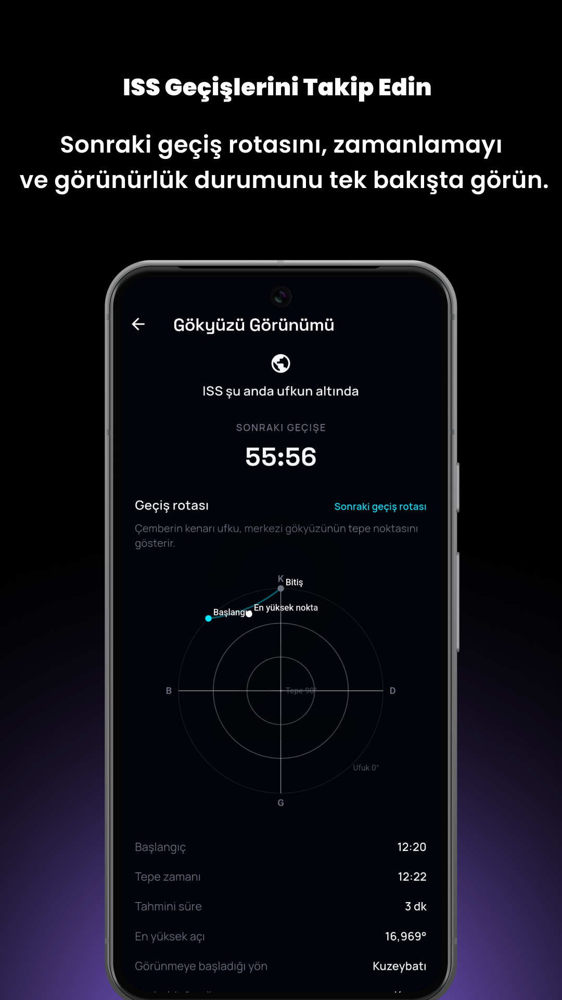
  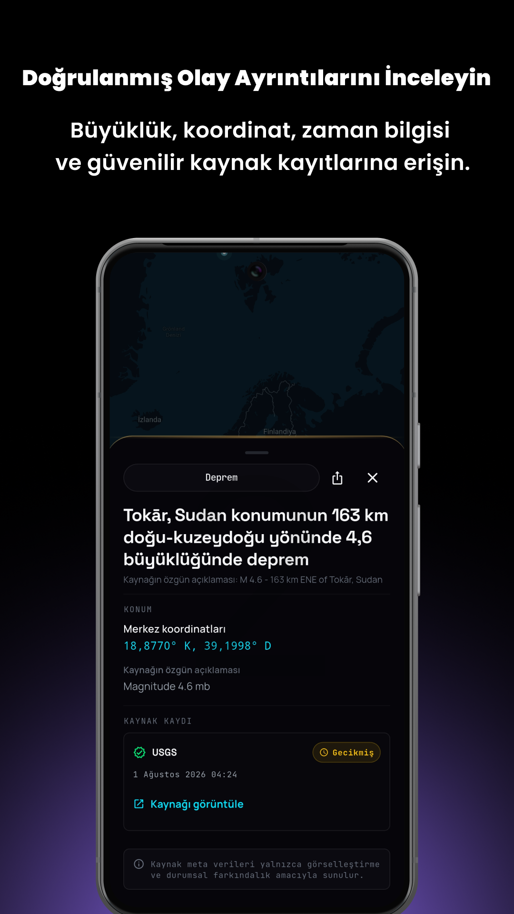

  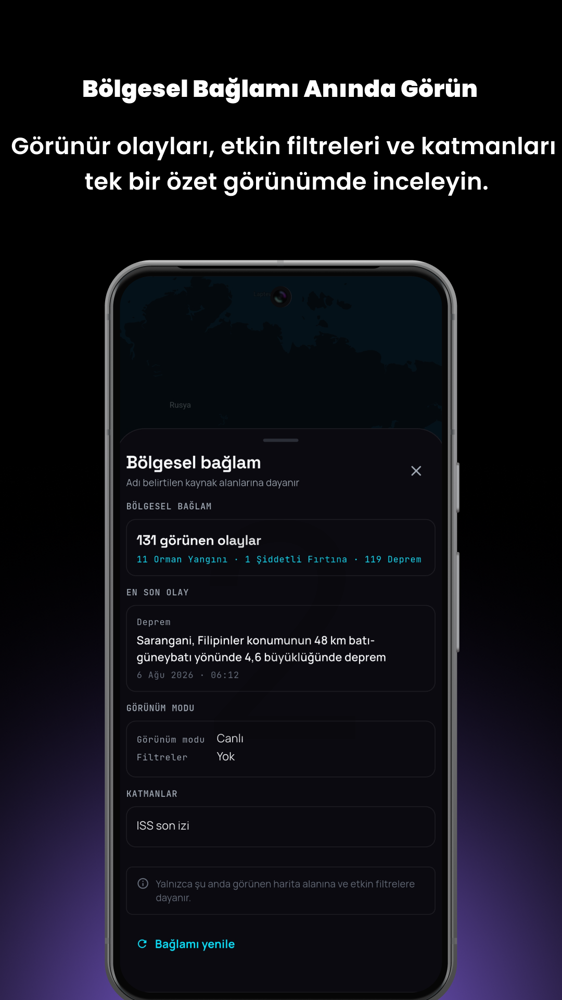
  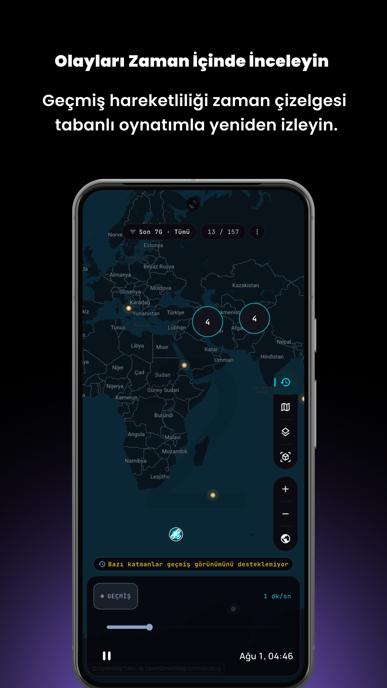
  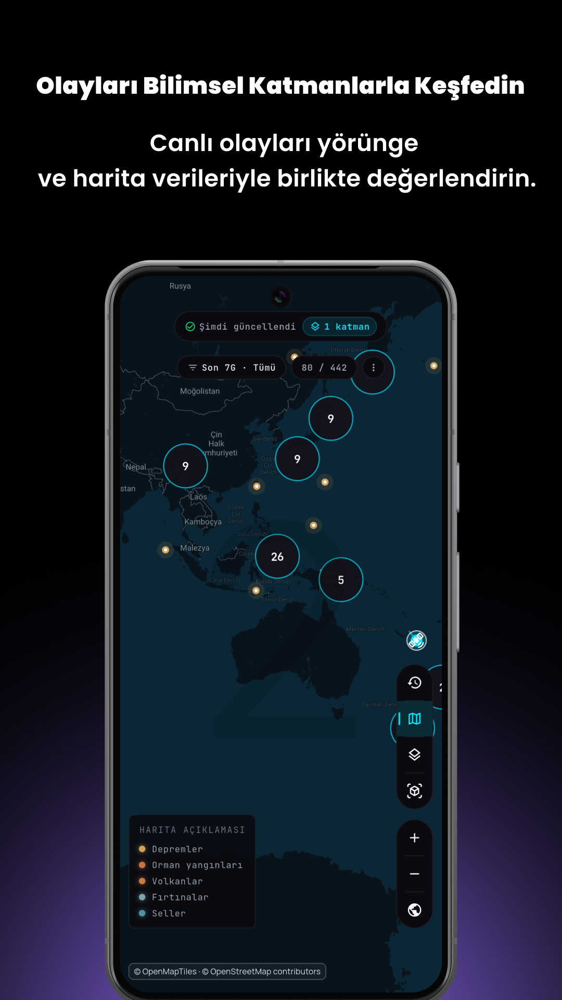

## Privacy Policy

https://berkayol.github.io/Eontera-Privacy-Policy/

---

**Eontera is independently developed and is not affiliated with or endorsed by NASA, USGS, CelesTrak, OpenStreetMap, or other referenced data providers.**
