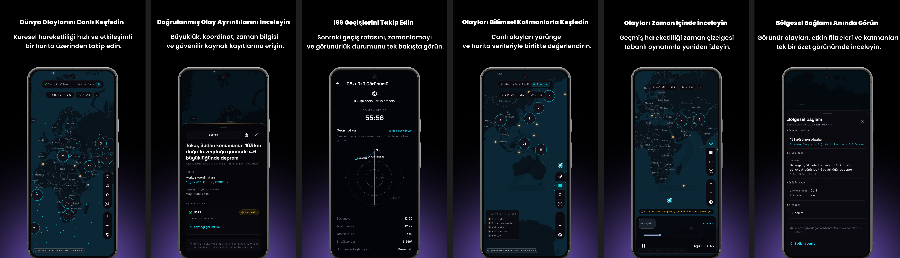

# Eontera: Natural Events

**A source-backed natural event awareness and scientific data visualization application built with Flutter.**

[English](#english) · [Türkçe](#turkce)

---

# English

> **Google Play Status:** Closed Testing
> **Platform:** Android
> **Source Code:** Private Repository
> **Developer:** Berkay Ay

## About Eontera

**Eontera** is an independently developed Flutter application for exploring source-backed natural events and environmental data through a unified interactive map.

The application brings together global natural event data, geospatial visualization, scientific imagery, historical playback, regional context, watch-zone flows, and ISS/sky information under a single product experience.

Eontera is designed as an **informational and data-visualization application**. It is not an official warning, emergency-response, or hazard-prediction service.

## Key Features

* Live global natural event map
* Earthquake, wildfire, flood, storm, volcano, and other event data
* Source-backed event details, timestamps, and coordinates
* Scientific satellite imagery and map layers
* ISS pass and orbital context
* Timeline-based historical event playback
* Regional context summaries
* On-device watch zones and preferences
* Turkish and English localization
* Source transparency and original record access

## Screenshots

### Live Global Event Map

  

Explore global natural events through an interactive map with event markers, clustering, filters, and map controls.

### Source-Backed Event Details

  

Inspect event magnitude, coordinates, timestamps, source status, and original scientific source records.

### ISS & Sky View

  

View upcoming ISS pass timing, estimated duration, elevation, direction, and observer-relative sky path information.

### Scientific Layers

  

Combine live natural events with scientific imagery, orbital context, and map-based environmental data.

### Historical Playback

  

Replay past activity through timeline-based playback and map history.

### Regional Context

  

Review visible events, active filters, current view state, and enabled scientific layers in a unified regional summary.

## Data Sources

Eontera integrates publicly accessible scientific and environmental data sources, including:

* **NASA EONET** — natural event records
* **U.S. Geological Survey (USGS)** — earthquake records
* **NASA GIBS / EOSDIS Earthdata** — scientific imagery layers
* **CelesTrak** — orbital elements used for ISS and satellite context
* **Public ISS data services** — ISS position and observer-relative context
* **OpenFreeMap** — basemap delivery using OpenStreetMap-derived map data

## Technical Overview

* Flutter / Dart
* REST APIs
* Geospatial data processing
* Interactive map interfaces
* Scientific data visualization
* Local device storage
* Turkish / English localization
* Android release workflows
* Google Play testing and release preparation
* Git / GitHub

## Privacy & Product Principles

Eontera is designed with a privacy-conscious product model:

* No account required
* No advertising
* No behavioral profiling
* No analytics SDK intentionally integrated
* Watch zones and user preferences remain on-device
* Source attribution and data transparency are treated as core product features
* Sensitive release credentials and signing material are kept outside the repository

## Google Play

Eontera is currently undergoing **Google Play Closed Testing** before production release.

A public Google Play link will be added after production availability.

## Source Code

The production source code is maintained in a **private repository**.

This public repository exists solely as a **portfolio and product showcase**.

It does **not** contain:

* Application source code
* API secrets
* Environment files
* Signing credentials
* Keystores
* Private configuration
* Internal release credentials

## Privacy Policy

[Eontera Privacy Policy](https://berkayol.github.io/Eontera-Privacy-Policy/)

---

# Türkçe

> **Google Play Durumu:** Kapalı Test
> **Platform:** Android
> **Kaynak Kod:** Private Repository
> **Geliştirici:** Berkay Ay

## Eontera Hakkında

**Eontera**, doğrulanabilir kaynaklara dayanan doğal olayları ve bilimsel çevre verilerini birleşik bir interaktif harita deneyimi üzerinden keşfetmek için Flutter ile bağımsız olarak geliştirilmiş bir mobil uygulamadır.

Uygulama; küresel doğal olay verilerini, coğrafi veri görselleştirmeyi, bilimsel görüntü katmanlarını, geçmiş oynatımını, bölgesel bağlamı, izleme bölgelerini ve ISS/gökyüzü bilgilerini tek bir ürün deneyiminde bir araya getirir.

Eontera, **bilgilendirme ve veri görselleştirme amacıyla** geliştirilmiştir. Resmî uyarı, acil durum müdahale veya tehlike tahmin hizmeti değildir.

## Temel Özellikler

* Canlı küresel doğal olay haritası
* Deprem, orman yangını, sel, fırtına, volkan ve diğer olay verileri
* Kaynak destekli olay ayrıntıları, zaman bilgileri ve koordinatlar
* Bilimsel uydu görüntüleri ve harita katmanları
* ISS geçiş ve yörünge bağlamı
* Zaman çizelgesi tabanlı geçmiş olay oynatımı
* Bölgesel bağlam özetleri
* Cihaz üzerinde saklanan izleme bölgeleri ve tercihler
* Türkçe ve İngilizce lokalizasyon
* Kaynak şeffaflığı ve orijinal kayıt erişimi

## Ekran Görüntüleri

### Canlı Küresel Olay Haritası

  

Doğal olayları; marker'lar, cluster yapıları, filtreler ve harita kontrolleri üzerinden küresel ölçekte inceleyin.

### Kaynak Destekli Olay Ayrıntıları

  

Olayların büyüklük, koordinat, zaman, kaynak durumu ve orijinal bilimsel kayıt bilgilerine erişin.

### ISS & Gökyüzü Görünümü

  

Yaklaşan ISS geçişlerinin zamanını, tahmini süresini, yüksekliğini, yönünü ve gözlemciye göre gökyüzü rotasını inceleyin.

### Bilimsel Katmanlar

  

Canlı doğal olayları bilimsel görüntüler, yörünge bağlamı ve harita tabanlı çevresel verilerle birlikte değerlendirin.

### Geçmiş Olay Oynatımı

  

Geçmiş doğal olay hareketliliğini zaman çizelgesi tabanlı oynatım ve harita geçmişi üzerinden inceleyin.

### Bölgesel Bağlam

  

Görünür olayları, etkin filtreleri, mevcut görünüm durumunu ve aktif bilimsel katmanları tek bir bölgesel özet içerisinde inceleyin.

## Veri Kaynakları

Eontera, kamuya açık bilimsel ve çevresel veri kaynaklarından yararlanır:

* **NASA EONET** — doğal olay kayıtları
* **U.S. Geological Survey (USGS)** — deprem kayıtları
* **NASA GIBS / EOSDIS Earthdata** — bilimsel görüntü katmanları
* **CelesTrak** — ISS ve uydu bağlamı için yörünge elemanları
* **Kamuya açık ISS servisleri** — ISS konumu ve gözlemciye göre bağlam
* **OpenFreeMap** — OpenStreetMap tabanlı veriler kullanan temel harita hizmeti

## Teknik Genel Bakış

* Flutter / Dart
* REST API entegrasyonları
* Coğrafi veri işleme
* İnteraktif harita arayüzleri
* Bilimsel veri görselleştirme
* Cihaz içi yerel veri yönetimi
* Türkçe / İngilizce lokalizasyon
* Android release süreçleri
* Google Play test ve yayın hazırlıkları
* Git / GitHub

## Gizlilik & Ürün İlkeleri

Eontera, gizlilik bilinci gözetilerek geliştirilmiştir:

* Hesap oluşturma gerektirmez
* Reklam içermez
* Davranışsal profilleme yapmaz
* Bilerek entegre edilmiş analytics SDK'sı bulunmaz
* İzleme bölgeleri ve kullanıcı tercihleri cihaz üzerinde tutulur
* Kaynak atfı ve veri şeffaflığı temel ürün prensipleridir
* Release credential ve signing materyalleri repository dışında tutulur

## Google Play

Eontera şu anda üretim sürümünden önce **Google Play Kapalı Test** sürecindedir.

Uygulama production olarak yayınlandığında Google Play bağlantısı bu showcase repository'sine eklenecektir.

## Kaynak Kod

Production kaynak kodu **private repository** içerisinde tutulmaktadır.

Bu public repository yalnızca **portföy ve ürün vitrini** amacıyla hazırlanmıştır.

Aşağıdaki içerikleri barındırmaz:

* Uygulama kaynak kodu
* API secret'ları
* Environment dosyaları
* Signing credential'ları
* Keystore dosyaları
* Private configuration
* Dahili release credential'ları

## Gizlilik Politikası

[Eontera Gizlilik Politikası](https://berkayol.github.io/Eontera-Privacy-Policy/#turkce)

---

## Disclaimer

Eontera is independently developed and is not affiliated with or endorsed by NASA, USGS, CelesTrak, OpenStreetMap, OpenFreeMap, or other referenced data providers.

Eontera bağımsız olarak geliştirilmiştir; NASA, USGS, CelesTrak, OpenStreetMap, OpenFreeMap veya diğer adı geçen veri sağlayıcılarıyla bağlantılı değildir ve bu kuruluşlar tarafından onaylanmamaktadır.
